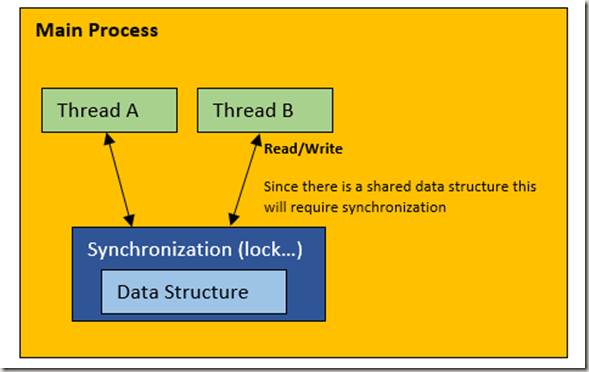
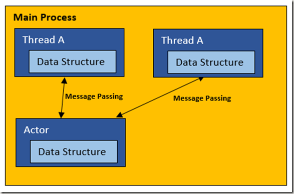
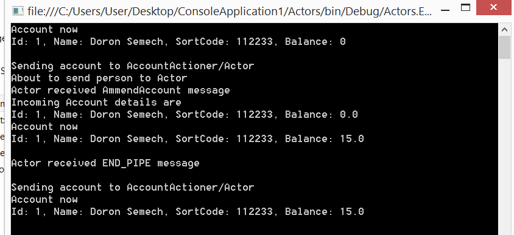

NetMQ Actor Model
===

## What is an Actor model?

From [Wikipedia's Actor Model page](http://en.wikipedia.org/wiki/Actor_model):

> The actor model in computer science is a mathematical model of concurrent computation that treats “actors” as the universal primitives of concurrent digital computation: in response to a message that it receives, an actor can make local decisions, create more actors, send more messages, and determine how to respond to the next message received.
>
> The Actor model adopts the philosophy that everything is an actor. This is similar to the everything is an object philosophy used by some object-oriented programming languages, but differs in that object-oriented software is typically executed sequentially, while the Actor model is inherently concurrent.
>
> An actor is a computational entity that, in response to a message it receives, can concurrently:
>
> * send a finite number of messages to other actors
> * create a finite number of new actors
> * designate the behavior to be used for the next message it receives
>
> There is no assumed sequence to the above actions and they could be carried out in parallel.
>
> Decoupling the sender from communications sent was a fundamental advance of the Actor model enabling asynchronous communication and control structures as patterns of passing messages.
>
> Recipients of messages are identified by address, sometimes called “mailing address”. Thus an actor can only communicate with actors whose addresses it has. It can obtain those from a message it receives, or if the address is for an actor it has itself created.
>
> The Actor model is characterized by inherent concurrency of computation within and among actors, dynamic creation of actors, inclusion of actor addresses in messages, and interaction only through direct asynchronous message passing with no restriction on message arrival order.

A nice way to think of Actors is that they may be used to alleviate some of synchronization concerns of using shared data structures. This is achieved by your application code talking to actors via message passing/receiving. The actor itself may pass messages to other actors, or work on the passed message itself. By using message passing rather than using shared data structures, it may help to think of the actor (or any subsequent actors its send messages to) working on a copy of the data rather than working on the same shared structures. Which kind of gets rid of the need to worry about nasty things like lock(s) and any nasty timing issues that may arise from carrying out multi threaded code. If the actor is working with its own copy of the data then we should have no issues with other threads wanting to work with the data  the actor has, as the only place that data can be is within the actor itself, that is unless we pass another message to a different actor. If we were to do that though the new message to the other actor would also be a copy of the data, so would also be thread safe.

I hope you see what I am trying to explain there, maybe a diagram may help.

## Multi-threading with shared data

A fairly common thing to do is have multiple threads running to speed things up, but then you realise that your threads need to mutate the state of some shared data structure, so then you have to involve threading synchronization primitives (most commonly `lock(..)` statements, to create your user defined critical sections). This will work, but now you are introducing artificial delays due to having to wait for the lock to be released so you can run Thread X’s code.



To take this one step further, let's see some code that may illustrate this further. Imagine we had this sort of data structure representing a very slim bank account:

``` csharp
public class Account
{
    public Account(int id, string name, string sortCode, decimal balance)
    {
        Id = id;
        Name = name;
        SortCode = sortCode;
        Balance = balance;
    }
    public int Id { get; set; }
    public string Name { get; set; }
    public string SortCode { get; set; }
    public decimal Balance { get; set; }
    public override string ToString()
    {
        return string.Format("Id: {0}, Name: {1}, SortCode: {2}, Balance: {3}",
            Id, Name, SortCode, Balance);
    }
}
```

Nothing fancy there, just some fields. So lets now move onto looking at some threading code, I have chosen to just show two threads acting on a shared `Account` instance.

``` csharp
static void Main()
{
    var account = new Account(1, "sacha barber", "112233", 0);
    var syncLock = new object();
    // start two asynchronous tasks that both mutate the account balance
    var task1 = Task.Run(() =>
    {
        var threadId = Thread.CurrentThread.ManagedThreadId;
        Console.WriteLine("Thread Id {0}, Account balance before: {1}",
            threadId, account.Balance);
        lock (syncLock)
        {
            Console.WriteLine("Thread Id {0}, Adding 10 to balance",
                threadId);
            account.Balance += 10;
            Console.WriteLine("Thread Id {0}, Account balance after: {1}",
                threadId, account.Balance);
        }
    });
    var task2 = Task.Run(() =>
    {
        var threadId = Thread.CurrentThread.ManagedThreadId;
        Console.WriteLine("Thread Id {0}, Account balance before: {1}",
            threadId, account.Balance);
        lock (syncLock)
        {
            Console.WriteLine("Thread Id {0}, Subtracting 4 from balance",
               threadId);
            account.Balance -= 4;
            Console.WriteLine("Thread Id {0}, Account balance after: {1}",
                threadId, account.Balance);
        }
    });
    // wait for all tasks to complete
    task1.Wait();
    task2.Wait();
}
```

This may be an example that you think may not actually happen in real life, and to be honest this scenario may not popup in real life, as who would do something as silly as crediting an account in one thread, and debiting it in another…we are all diligent developers, we would not let this one into the code would we?

To be honest whether the actual example has real world merit or not, the point remains the same, since we have more than one thread accessing a shared data structure, access to it must be synchronized, which is typically done using a lock(..) statement, as can be seen in the code.

Now don’t get me wrong the above code does work, as shown in the output below:

``` text
Thread Id 6, Account balance before: 0
Thread Id 6, Adding 10 to balance
Thread Id 6, Account balance after: 10
Thread Id 10, Account balance before: 10
Thread Id 10, Subtracting 4 to balance
Thread Id 10, Account balance after: 6
```

Perhaps there might be a more interesting way though!


## Actor model

The actor model, takes a different approach, where by message passing is used, which may involve some form of serialization as the messages are pass down the wire, which kind of guarantees no shared structures to contend with. Now I am not saying all Actor frameworks use message passing down the wire (serialization) but the code presented in this article does.

The basic idea is that each thread would talk to an actor, and send/receive message with the actor.

If you wanted to get even more isolation, you could use thread local storage where each thread could have its own copy of the actor which it, and it alone talks to.



Anyway enough talking, I am sure some of you want to see the code right?


## Actor demo

We will stick with the same type of example as we did when we used a more traditional locking/shared data approach.

Firstly lets introduce a few helper classes

### AccountAction

``` csharp
public enum TransactionType { Debit = 1, Credit = 2 }
public class AccountAction
{
    public AccountAction(TransactionType transactionType, decimal amount)
    {
        TransactionType = transactionType;
        Amount = amount;
    }
    public TransactionType TransactionType { get; set; }
    public decimal Amount { get; set; }
}
```

### Account

This is the same as before:

``` csharp
public class Account
{
    public Account(int id, string name, string sortCode, decimal balance)
    {
        Id = id;
        Name = name;
        SortCode = sortCode;
        Balance = balance;
    }
    public int Id { get; set; }
    public string Name { get; set; }
    public string SortCode { get; set; }
    public decimal Balance { get; set; }
    public override string ToString()
    {
        return string.Format("Id: {0}, Name: {1}, SortCode: {2}, Balance: {3}",
            Id, Name, SortCode, Balance);
    }
}
```

### AccountActioner

And here is the entire code for an `Actor` that deals with `Account` actions. This example is deliberately simplistic, where we only debit/credit an `Account`
by an amount. You could send any command to the `Actor`, and the `Actor` is really a general purpose in process messaging system.

Anyway here is the `Actor` code:

``` csharp
public class AccountActioner
{
    public class ShimHandler : IShimHandler
    {
        private PairSocket shim;
        private NetMQPoller poller;
        public void Initialise(object state)
        {
        }
        public void Run(PairSocket shim)
        {
            this.shim = shim;
            shim.ReceiveReady += OnShimReady;
            shim.SignalOK();
            poller = new NetMQPoller { shim };
            poller.Run();
        }
        private void OnShimReady(object sender, NetMQSocketEventArgs e)
        {
            string command = e.Socket.ReceiveFrameString();
            switch (command)
            {
                case NetMQActor.EndShimMessage:
                    Console.WriteLine("Actor received EndShimMessage");
                    poller.Stop();
                    break;
                case "AmmendAccount":
                    Console.WriteLine("Actor received AmmendAccount message");
                    string accountJson = e.Socket.ReceiveFrameString();
                    Account account
                        = JsonConvert.DeserializeObject<Account>(accountJson);
                    string accountActionJson = e.Socket.ReceiveFrameString();
                    AccountAction accountAction
                        = JsonConvert.DeserializeObject<AccountAction>(
                            accountActionJson);
                    Console.WriteLine("Incoming Account details are");
                    Console.WriteLine(account);
                    AmmendAccount(account, accountAction);
                    shim.SendFrame(JsonConvert.SerializeObject(account));
                    break;
            }
        }
        private void AmmendAccount(Account account, AccountAction accountAction)
        {
            switch (accountAction.TransactionType)
            {
                case TransactionType.Credit:
                    account.Balance += accountAction.Amount;
                    break;
                case TransactionType.Debit:
                    account.Balance -= accountAction.Amount;
                    break;
            }
        }
    }
    private NetMQActor actor;
    public void Start()
    {
        if (actor != null)
            return;
        actor = NetMQActor.Create(new ShimHandler());
    }
    public void Stop()
    {
        if (actor != null)
        {
            actor.Dispose();
            actor = null;
        }
    }
    public void SendPayload(Account account, AccountAction accountAction)
    {
        if (actor == null)
            return;
        Console.WriteLine("About to send person to Actor");
        var message = new NetMQMessage();
        message.Append("AmmendAccount");
        message.Append(JsonConvert.SerializeObject(account));
        message.Append(JsonConvert.SerializeObject(accountAction));
        actor.SendMultipartMessage(message);
    }
    public Account GetPayLoad()
    {
        return JsonConvert.DeserializeObject<Account>(actor.ReceiveFrameString());
    }
}
```

### Tying it all together

You would communicate with this `Actor` code using something like the following. Again, this could use any commands you want&mdash;this example just shows how to debit/credit an `Account`.

``` csharp
class Program
{
    static void Main(string[] args)
    {
        // CommandActioner uses an NetMq.Actor internally
        var accountActioner = new AccountActioner();
        var account = new Account(1, "Doron Somech", "112233", 0);
        PrintAccount(account);
        accountActioner.Start();
        Console.WriteLine("Sending account to AccountActioner/Actor");
        accountActioner.SendPayload(account,
            new AccountAction(TransactionType.Credit, 15));
        account = accountActioner.GetPayLoad();
        PrintAccount(account);
        accountActioner.Stop();
        Console.WriteLine();
        Console.WriteLine("Sending account to AccountActioner/Actor");
        accountActioner.SendPayload(account,
            new AccountAction(TransactionType.Credit, 15));
        PrintAccount(account);
        Console.ReadLine();
    }
    static void PrintAccount(Account account)
    {
        Console.WriteLine("Account now");
        Console.WriteLine(account);
        Console.WriteLine();
    }
}
```

When you run this code you should see something like this:



We hope that gives you a taster of what you could do with an `Actor`
