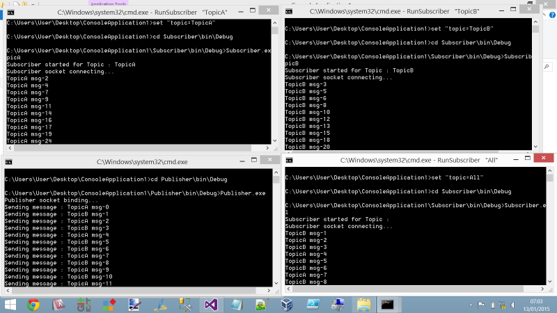

Pub/Sub
=====

From [Wikipedia](http://en.wikipedia.org/wiki/Publish%E2%80%93subscribe_pattern):

> Publish–subscribe is a messaging pattern where senders of messages, called publishers, do not program the messages to be sent directly to specific receivers, called subscribers. Instead, published messages are characterized into classes, without knowledge of what, if any, subscribers there may be. Similarly, subscribers express interest in one or more classes, and only receive messages that are of interest, without knowledge of what, if any, publishers there are.

The _classes_ mentioned in this description can also be referred to as _topics_ or _filters_.

NetMQ comes with support for Pub/Sub by way of two socket types:

+ `PublisherSocket`
+ `SubscriberSocket`

## Topics

ZeroMQ/NetMQ uses multipart [messages](message.md) to convey topic information. Topics are expressed as an array of bytes, though you may use a string and suitable `System.Text.Encoding`.

A publisher must include the topic in the message's' first frame, prior to the message payload. For example, to publish a status message to subscribers of the `status` topic:

    :::csharp
    // send a message on the 'status' topic
    pub.SendMoreFrame("status").SendFrame("All is well");

Subscribers specify which topics they are interested in via the `Subscribe` method of `SubscriberSocket`:

    :::csharp
    // subscribe to the 'status' topic
    sub.Subscribe("status");

## Topic heirarchies

A message's topic is compared against subscribers' subscription topics using a prefix check.

That is, a subscriber who subscribed to `topic` would receive messages with topics:

* `topic`
* `topic/subtopic`
* `topical`

However it would not receive messages with topics:

* `topi`
* `TOPIC` (remember, it's a byte-wise comparison)

A consequence of this prefix matching behavious is that you can receive all published messages by subscribing with an empty topic string:

    :::csharp
    sub.Subscribe(""); // subscribe to all topics

## An Example

Time for an example. This example is very simple, and follows these rules.

+ There is one publisher process, who randomly publishes a message to either `TopicA` or `TopicB` every 500ms.
+ There may be many subscribers. The topic name is passed as a command line argument.

### Publisher

    :::csharp
    using System;
    using System.Threading;
    using NetMQ;
    using NetMQ.Sockets;

    namespace Publisher
    {
        class Program
        {
            static void Main(string[] args)
            {
                Random rand = new Random(50);

                using (var pubSocket = new PublisherSocket())
                {
                    Console.WriteLine("Publisher socket binding...");
                    pubSocket.Options.SendHighWatermark = 1000;
                    pubSocket.Bind("tcp://localhost:12345");

                    for (var i = 0; i < 100; i++)
                    {
                        var randomizedTopic = rand.NextDouble();
                        if (randomizedTopic > 0.5)
                        {
                            var msg = "TopicA msg-" + i;
                            Console.WriteLine("Sending message : {0}", msg);
                            pubSocket.SendMoreFrame("TopicA").SendFrame(msg);
                        }
                        else
                        {
                            var msg = "TopicB msg-" + i;
                            Console.WriteLine("Sending message : {0}", msg);
                            pubSocket.SendMoreFrame("TopicB").SendFrame(msg);
                        }

                        Thread.Sleep(500);
                    }
                }
            }
        }
    }

### Subscriber

    :::csharp
    using System;
    using System.Collections.Generic;
    using System.Diagnostics;
    using System.Linq;
    using System.Text;
    using System.Threading.Tasks;
    using NetMQ;
    using NetMQ.Sockets;

    namespace SubscriberA
    {
        class Program
        {
            public static IList<string> allowableCommandLineArgs
                = new [] { "TopicA", "TopicB", "All" };

            static void Main(string[] args)
            {
                if (args.Length != 1 || !allowableCommandLineArgs.Contains(args[0]))
                {
                    Console.WriteLine("Expected one argument, either " +
                                      "'TopicA', 'TopicB' or 'All'");
                    Environment.Exit(-1);
                }

                string topic = args[0] == "All" ? "" : args[0];
                Console.WriteLine("Subscriber started for Topic : {0}", topic);

                using (var subSocket = new SubscriberSocket())
                {
                    subSocket.Options.ReceiveHighWatermark = 1000;
                    subSocket.Connect("tcp://localhost:12345");
                    subSocket.Subscribe(topic);
                    Console.WriteLine("Subscriber socket connecting...");
                    while (true)
                    {
                        string messageTopicReceived = subSocket.ReceiveFrameString();
                        string messageReceived = subSocket.ReceiveFrameString();
                        Console.WriteLine(messageReceived);
                    }
                }
            }
        }
    }

To run this, these three BAT files may be useful, though you will need to change them to suit your code location should you choose to copy this example code into a new set of projects.

### RunPubSub.bat

    :::text
    start RunPublisher.bat
    start RunSubscriber "TopicA"
    start RunSubscriber "TopicB"
    start RunSubscriber "All"

### RunPublisher.bat

    :::text
    cd Publisher\bin\Debug
    Publisher.exe

### RunSubscriber.bat

    ::text
    set "topic=%~1"
    cd Subscriber\bin\Debug
    Subscriber.exe %topic%

When run, you should see something like this:

Other Considerations
=====

### High water mark

The `SendHighWaterMark`/`ReceiveHighWaterMark` options set the high water mark for the specified socket. The high water mark is a hard limit on the maximum number of outstanding messages NetMQ shall queue in memory for any single peer that the specified socket is communicating with.

If this limit has been reached the socket shall enter an exceptional state and depending on the socket type, NetMQ shall take appropriate action such as blocking or dropping sent messages.

The default `SendHighWaterMark`/`ReceiveHighWaterMark` value is 1000. The value of zero means "no limit".

You would set these 2 options using the `xxxxSocket.Options` property as follows:

+  `pubSocket.Options.SendHighWatermark = 1000;`
+  `pubSocket.Options.ReceiveHighWatermark = 1000;`

### Slow subscribers

This is covered in the <a href="http://zguide.zeromq.org/php:chapter5" target="_blank">ZeroMQ guide</a>

### Late joining subscribers

This is covered in the <a href="http://zguide.zeromq.org/php:chapter5" target="_blank">ZeroMQ guide</a>
