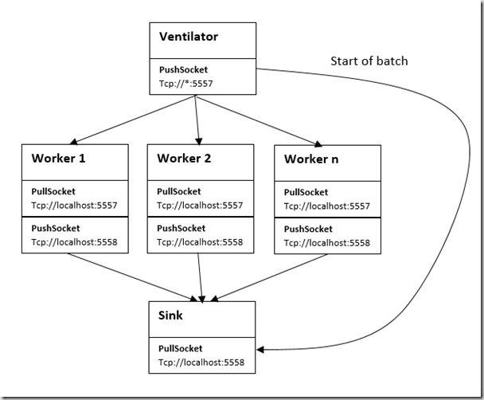

Push / Pull
=====

NetMQ comes with a `PushSocket` and a `PullSocket`. What are these and how should they be used?

Well a `PushSocket` is normally used to push to a `PullSocket`, whilst the `PullSocket` will pull from a `PushSocket`. Sounds obvious right!

You would typically use this configuration of sockets to produce some distributed work, kind of like a <a href="http://zguide.zeromq.org/page:all#Divide-and-Conquer" target="_blank">divide and conquer</a> arrangement.

The idea is that you have something that generates work, and then distributes the work out to n-many workers. The workers each do some work, and push their results to some other process (could be a thread too) where the workers results are accumulated.

In the <a href="http://zguide.zeromq.org/page:all" target="_blank">ZeroMQ guide</a>, it shows an example that has the work generator just tell each worker to sleep for a period of time.

We toyed with creating a more elaborate example than this, but in the end felt that the example's simplicity was quite important, so we have stuck with the workload for each worker just being a value that tells the work to sleep for a number of milliseconds (thus simulating some actual work). This example, as I say, has been borrowed from the <a href="http://zguide.zeromq.org/page:all" target="_blank">ZeroMQ guide</a>.

In real life the work could obviously be anything, though you would more than likely want the work to be something that could be cut up and distributed without the work generator caring/knowing how many workers there are.

Here is what we are trying to achieve :



## Ventilator

``` csharp
using System;
using NetMQ;
namespace Ventilator
{
    public class Program
    {
        public static void Main(string[] args)
        {
            // Task Ventilator
            // Binds PUSH socket to tcp://localhost:5557
            // Sends batch of tasks to workers via that socket
            Console.WriteLine("====== VENTILATOR ======");
            using (var sender = new PushSocket("@tcp://*:5557"))
            using (var sink = new PullSocket(">tcp://localhost:5558"))
            {
                Console.WriteLine("Press enter when worker are ready");
                Console.ReadLine();
                //the first message it "0" and signals start of batch
                //see the Sink.csproj Program.cs file for where this is used
                Console.WriteLine("Sending start of batch to Sink");
                sink.SendFrame("0");
                Console.WriteLine("Sending tasks to workers");
                //initialise random number generator
                Random rand = new Random(0);
                //expected costs in Ms
                int totalMs = 0;
                //send 100 tasks (workload for tasks, is just some random sleep time that
                //the workers can perform, in real life each work would do more than sleep
                for (int taskNumber = 0; taskNumber < 100; taskNumber++)
                {
                    //Random workload from 1 to 100 msec
                    int workload = rand.Next(0, 100);
                    totalMs += workload;
                    Console.WriteLine("Workload : {0}", workload);
                    sender.SendFrame(workload.ToString());
                }
                Console.WriteLine("Total expected cost : {0} msec", totalMs);
                Console.WriteLine("Press Enter to quit");
                Console.ReadLine();
            }
        }
    }
}
```

## Worker

``` csharp
using System;
using System.Threading;
using NetMQ;
namespace Worker
{
    public class Program
    {
        public static void Main(string[] args)
        {
            // Task Worker
            // Connects PULL socket to tcp://localhost:5557
            // collects workload for socket from Ventilator via that socket
            // Connects PUSH socket to tcp://localhost:5558
            // Sends results to Sink via that socket
            Console.WriteLine("====== WORKER ======");
            using (var receiver = new PullSocket(">tcp://localhost:5557"))
            using (var sender = new PushSocket(">tcp://localhost:5558"))
            {
                //process tasks forever
                while (true)
                {
                    //workload from the vetilator is a simple delay
                    //to simulate some work being done, see
                    //Ventilator.csproj Proram.cs for the workload sent
                    //In real life some more meaningful work would be done
                    string workload = receiver.ReceiveFrameString();
                    //simulate some work being done
                    Thread.Sleep(int.Parse(workload));
                    //send results to sink, sink just needs to know worker
                    //is done, message content is not important, just the presence of
                    //a message means worker is done.
                    //See Sink.csproj Proram.cs
                    Console.WriteLine("Sending to Sink");
                    sender.SendFrame(string.Empty);
                }
            }
        }
    }
}
```

## Sink

    ::csharp
    using System;
    using System.Diagnostics;
    using System.Threading;
    using System.Threading.Tasks;
    using NetMQ;

    namespace Sink
    {
        public class Program
        {
            public static void Main(string[] args)
            {
                // Task Sink
                // Bindd PULL socket to tcp://localhost:5558
                // Collects results from workers via that socket
                Console.WriteLine("====== SINK ======");

                //socket to receive messages on
                using (var receiver = new PullSocket("@tcp://localhost:5558"))
                {
                    //wait for start of batch (see Ventilator.csproj Program.cs)
                    var startOfBatchTrigger = receiver.ReceiveFrameString();
                    Console.WriteLine("Seen start of batch");

                    //Start our clock now
                    var watch = Stopwatch.StartNew();

                    for (int taskNumber = 0; taskNumber < 100; taskNumber++)
                    {
                        var workerDoneTrigger = receiver.ReceiveFrameString();
                        if (taskNumber % 10 == 0)
                        {
                            Console.Write(":");
                        }
                        else
                        {
                            Console.Write(".");
                        }
                    }
                    watch.Stop();
                    //Calculate and report duration of batch
                    Console.WriteLine();
                    Console.WriteLine("Total elapsed time {0} msec", watch.ElapsedMilliseconds);
                    Console.ReadLine();
                }
            }
        }
    }

## Running the sample

To run this, these three BAT files may be useful, though you will need to change them to suit your code location should you choose to copy this example code into a new set of projects.

### Run1Worker.bat

``` text
cd Ventilator/bin/Debug
start Ventilator.exe
cd../../..
cd Sink/bin/Debug
start Sink.exe
cd../../..
cd Worker/bin/Debug
start Worker.exe
```


Which when run should give you some output like this in the Sink process console output (obviously your PC may run faster/slower than mine):

``` text
====== SINK ======
Seen start of batch
:.........:.........:.........:.........:.........:.........:.........:.........
:.........:.........
Total elapsed time 5695 msec
```


### Run2Workers.bat

``` text
cd Ventilator/bin/Debug
start Ventilator.exe
cd../../..
cd Sink/bin/Debug
start Sink.exe
cd../../..
cd Worker/bin/Debug
start Worker.exe
start Worker.exe
```

Which when run should give you some output like this in the Sink process console output (obviously you PC may run faster/slower than mine):

``` text
====== SINK ======
Seen start of batch
:.........:.........:.........:.........:.........:.........:.........:.........
:.........:.........
Total elapsed time 2959 msec
```


### Run4Workers.bat

``` text
cd Ventilator/bin/Debug
start Ventilator.exe
cd../../..
cd Sink/bin/Debug
start Sink.exe
cd../../..
cd Worker/bin/Debug
start Worker.exe
start Worker.exe
start Worker.exe
start Worker.exe
```


Which when run should give you some output like this in the Sink process console output (obviously you PC may run faster/slower than mine):

``` text
====== SINK ======
Seen start of batch
:.........:.........:.........:.........:.........:.........:.........:.........
:.........:.........
Total elapsed time 1492 msec
```

There are a couple of points to be aware of with this pattern

+ The `Ventilator` uses a NetMQ `PushSocket` to distribute work to the `Worker`s, this is referred to as load balancing.
+ The `Ventilator` and the `Sink` are the static parts of the system, where as `Worker`s are dynamic. It is trivial to add more `Worker`s, we can just spin up a new instance of a `Worker`s, and in theory the work gets done quicker.
+ We need to synchronize the starting of the batch (when  `Worker`s are ready), as if we did not do that, the first `Worker`s that connected would get more messages that the rest, which is not really load balanced.
+ The `Sink` uses a NetMQ `PullSocket` to accumulate the results from the `Worker`s.
