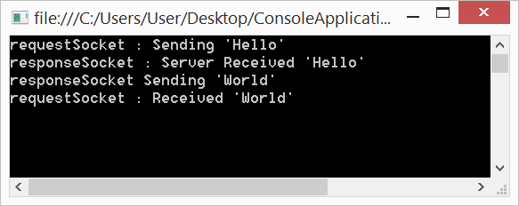
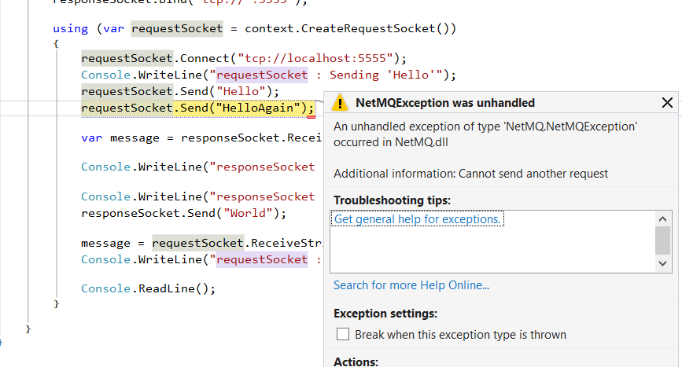
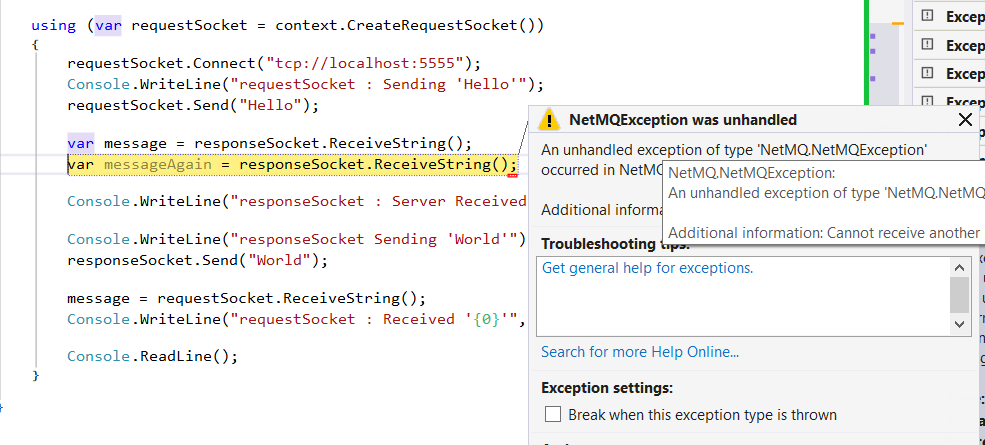

Request / Response
=====

Request / Response is perhaps the simplest of all the NetMQ socket combinations. That is not to say that `RequestSocket` and `ResponseSocket` MUST always be used together, that is not true at all, there are many occasions where you may want to use a particular NetMQ socket with another NetMQ socket. It is just that there are particular socket arrangements that happen to make a great deal of sense to use together, and `RequestSocket` with `ResponseSocket` is one such pattern.

The particular socket combinations that work well together are all covered in the <a href="http://zguide.zeromq.org/page:all" target="_blank">ZeroMQ guide</a>. Whilst it may seem a cop out to simply tell you to read more documentation somewhere else, there really is **NO BETTER** documentation on ZeroMQ/NetMQ than you will find in the <a href="http://zguide.zeromq.org/page:all" target="_blank">ZeroMQ guide</a>, as it covers well known patterns that have been proved in the field and are known to work well.

Anyway we digress, this post is about Request/Response, so lets continue to look at that, shall we?


## How it works

Request / Response pattern is a configuration of two NetMQ sockets working harmoniously together. This combination of sockets are akin to what you might see when you make a web request. That is, you make a request and you expect a response.

`RequestSocket` and `ResponseSocket` are **synchronous**, **blocking**, and throw exceptions if you try to read messages in the wrong order.

The way you should work with connected `RequestSocket` and `ResponseSocket`s is as follows:

1. Send a request message from a `RequestSocket`
2. A `ResponseSocket` reads the request message
3. The `ResponseSocket` sends the response message
4. The `RequestSocket` receives the message from the `ResponseSocket`

Believe it or not you have more than likely already seen this example on numerous occasions as it is the simplest to demonstrate.

Here is a small example where the `RequestSocket` and `ResponseSocket`s are both in the same process, but this could be easily split between two processes. We are keeping this as simple as possible for demonstration purposes.

Example:

``` csharp
using (var responseSocket = new ResponseSocket("@tcp://*:5555"))
using (var requestSocket = new RequestSocket(">tcp://localhost:5555"))
{
    Console.WriteLine("requestSocket : Sending 'Hello'");
    requestSocket.SendFrame("Hello");
    var message = responseSocket.ReceiveFrameString();
    Console.WriteLine("responseSocket : Server Received '{0}'", message);
    Console.WriteLine("responseSocket Sending 'World'");
    responseSocket.SendFrame("World");
    message = requestSocket.ReceiveFrameString();
    Console.WriteLine("requestSocket : Received '{0}'", message);
    Console.ReadLine();
}
```

When you run this demo code you should see something like this:




## Request/Response is blocking

As stated above `RequestSocket` and `ResponseSocket` are blocking, which means any unexpected send or receive calls to **WILL** result in exceptions. Here is an example of just such an exception.

In this example we try and call `Send()` twice from the `RequestSocket`



Or how about this example where we try and call `RecieveString()` twice, but there was only one message sent from the `RequestSocket`?



So be careful what you do with the Request/Response pattern, the devil is in the detail.
