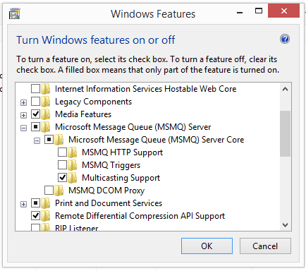

Transport Protocols
===

NetMQ comes with support for three main protocols

+ TCP (`tcp://`)
+ InProc (`inproc://`)
+ PGM (`pgm://`) &mdash; requires MSMQ and running as administrator

Each of these is discussed below.

## TCP

TCP is the most commonly used protocol. As such, most example code will use TCP.

### Example

Here is another trivial example:

    :::csharp
    using (var server = new ResponseSocket())
    using (var client = new RequestSocket())
    {
        server.Bind("tcp://*:5555");
        client.Connect("tcp://localhost:5555");

        Console.WriteLine("Sending Hello");
        client.SendFrame("Hello");

        var message = server.ReceiveFrameString();
        Console.WriteLine("Received {0}", message);

        Console.WriteLine("Sending World");
        server.SendFrame("World");

        message = client.ReceiveFrameString();
        Console.WriteLine("Received {0}", message);
    }

This code outputs:

    :::text
    Sending Hello
    Received Hello
    Sending World
    Received World

### Address format

Notice the format of the address string passed to `Bind()` and `Connect()`. For TCP connections, it will resemble:

    :::text
    tcp://*:5555

This is made up of three parts:

1. The protocol (`tcp`)
2. The host (an IP address, host name, or the wildcard `*` to match any)
3. The port number (`5555`)

## InProc

InProc (in-process) allows you to connect sockets running with the same process. This is actually quite useful, and you may do this for several reasons:

+ To do away with shared state/locks. When you send data down the wire (socket) there is no shared state to worry about. Each end of the socket will have its own copy.
+ Being able to communicate between very disparate parts of a system.

NetMQ comes with several components that use InProc, such the as [Actor model](actor.md) and [Devices](devices.md), which are discussed in their relevant documentation pages.

### Example

For now let's demonstrate a simple InProc arrangement by sending a string (for simplicity) between two threads.

    :::csharp
    using (var end1 = new PairSocket())
    using (var end2 = new PairSocket())
    {
        end1.Bind("inproc://inproc-demo");
        end2.Connect("inproc://inproc-demo");

        var end1Task = Task.Run(() =>
        {
            Console.WriteLine("ThreadId = {0}", Thread.CurrentThread.ManagedThreadId);
            Console.WriteLine("Sending hello down the inproc pipeline");
            end1.SendFrame("Hello");
        });
        var end2Task = Task.Run(() =>
        {
            Console.WriteLine("ThreadId = {0}", Thread.CurrentThread.ManagedThreadId);
            var message = end2.ReceiveFrameString();
            Console.WriteLine(message);
        });
        Task.WaitAll(new[] { end1Task, end2Task });
    }

This outputs something similar to:

    :::text
    ThreadId = 12
    ThreadId = 6
    Sending hello down the inproc pipeline
    Hello

### Address format

Notice the format of the address string passed to `Bind()` and `Connect()`. For InProc connections, it will resemble:

    :::text
    inproc://inproc-demo

This is made up of two parts:

1. The protocol (`inproc`)
2. The identifier (`inproc-demo` which can be any string, uniquely identified within the scope of the process)

## PGM

Pragmatic General Multicast (PGM) is a reliable multicast transport protocol for applications that require ordered
or unordered, duplicate-free, multicast data delivery from multiple sources to multiple receivers.

PGM guarantees that a receiver in the group either receives all data packets from transmissions and repairs, or
is able to detect unrecoverable data packet loss. PGM is specifically intended as a workable solution for multicast
applications with basic reliability requirements. Its central design goal is simplicity of operation with due
regard for scalability and network efficiency.

To use PGM with NetMQ, we do not have to do too much. We just need to follow these three pointers:

1. The socket types are now `PublisherSocket` and `SubscriberSocket`
   which are talked about in more detail in the [pub-sub pattern](pub-sub.md) documentation.
2. Make sure you are running the app as "Administrator"
3. Make sure you have turned on the "Multicasting Support". You can do that as follows:

### Example

Here is a small demo that use PGM, as well as `PublisherSocket` and `SubscriberSocket` and a few option values.

    :::csharp
    const int MegaBit = 1024;
    const int MegaByte = 1024;
    using (var pub = new PublisherSocket())
    using (var sub1 = new SubscriberSocket())
    using (var sub2 = new SubscriberSocket())
    {
        pub.Options.MulticastHops = 2;
        pub.Options.MulticastRate = 40 * MegaBit; // 40 megabit
        pub.Options.MulticastRecoveryInterval = TimeSpan.FromMinutes(10);
        pub.Options.SendBuffer = MegaByte * 10; // 10 megabyte
        pub.Connect("pgm://224.0.0.1:5555");

        sub1.Options.ReceiveBuffer = MegaByte * 10;
        sub1.Bind("pgm://224.0.0.1:5555");
        sub1.Subscribe("");

        sub2.Bind("pgm://224.0.0.1:5555");
        sub2.Options.ReceiveBuffer = MegaByte * 10;
        sub2.Subscribe("");

        Console.WriteLine("Server sending 'Hi'");
        pub.Send("Hi");

        bool more;
        Console.WriteLine("sub1 received = '{0}'", sub1.ReceiveString(out more));
        Console.WriteLine("sub2 received = '{0}'", sub2.ReceiveString(out more));
    }

Which when run gives the following sort of output:

    :::text
    Server sending 'Hi'
    sub1 received = 'Hi'
    sub2 received = 'Hi'

### Address format

Notice the format of the address string passed to `Bind()` and `Connect()`. For InProc connections, it will resemble:

    :::text
    pgm://224.0.0.1:5555

This is made up of three parts:

1. The protocol (`pgm`)
2. The host (an IP address such as `244.0.0.1`, host name, or the wildcard `*` to match any)
3. The port number (`5555`)

Another good source for PGM information is NetMQ's [PGM unit tests](https://github.com/zeromq/netmq/blob/master/src/NetMQ.Tests/PgmTests.cs).
