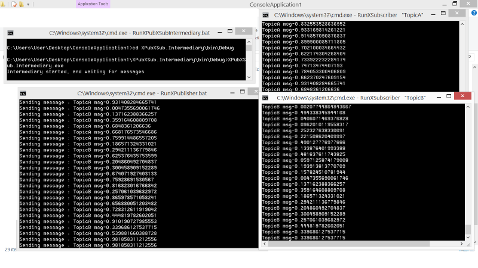

XPub / XSub
=====

The [Pub/Sub](pub-sub.md) pattern is great for multiple subscribers and a single publisher, but if you need multiple publishers then the XPub/XSub pattern will be of interest.

XPub/XSub can also assist with the so-called _dynamic discovery problem_. From the [ZeroMQ guide](http://zguide.zeromq.org/page:all#The-Dynamic-Discovery-Problem):

> One of the problems you will hit as you design larger distributed architectures is discovery. That is, how do pieces know about each other? It's especially difficult if pieces come and go, so we call this the "dynamic discovery problem".
>
> There are several solutions to dynamic discovery. The simplest is to entirely avoid it by hard-coding (or configuring) the network architecture so discovery is done by hand. That is, when you add a new piece, you reconfigure the network to know about it.
>
> 
>
> In practice, this leads to increasingly fragile and unwieldy architectures. Let's say you have one publisher and a hundred subscribers. You connect each subscriber to the publisher by configuring a publisher endpoint in each subscriber. That's easy. Subscribers are dynamic; the publisher is static. Now say you add more publishers. Suddenly, it's not so easy any more. If you continue to connect each subscriber to each publisher, the cost of avoiding dynamic discovery gets higher and higher.
>
> 
>
> There are quite a few answers to this, but the very simplest answer is to add an intermediary; that is, a static point in the network to which all other nodes connect. In classic messaging, this is the job of the message broker. ZeroMQ doesn't come with a message broker as such, but it lets us build intermediaries quite easily.
>
> You might wonder, if all networks eventually get large enough to need intermediaries, why don't we simply have a message broker in place for all applications? For beginners, it's a fair compromise. Just always use a star topology, forget about performance, and things will usually work. However, message brokers are greedy things; in their role as central intermediaries, they become too complex, too stateful, and eventually a problem.
>
> It's better to think of intermediaries as simple stateless message switches. A good analogy is an HTTP proxy; it's there, but doesn't have any special role. Adding a pub-sub proxy solves the dynamic discovery problem in our example. We set the proxy in the "middle" of the network. The proxy opens an XSUB socket, an XPUB socket, and binds each to well-known IP addresses and ports. Then, all other processes connect to the proxy, instead of to each other. It becomes trivial to add more subscribers or publishers.
>
> We need XPUB and XSUB sockets because ZeroMQ does subscription forwarding from subscribers to publishers. XSUB and XPUB are exactly like SUB and PUB except they expose subscriptions as special messages. The proxy has to forward these subscription messages from subscriber side to publisher side, by reading them from the XSUB socket and writing them to the XPUB socket. This is the main use case for XSUB and XPUB.

## An Example

So now that we have gone through why you would use XPub/XSub, lets now look at an example that follows the above description. It is broken down into three components:

+ Publisher
+ Intermediary
+ Subscriber

### Publisher

It can be seen that the `PublisherSocket` connnects to the `XSubscriberSocket` address

    :::csharp
    using (var pubSocket = new PublisherSocket(">tcp://127.0.0.1:5678"))
    {
        Console.WriteLine("Publisher socket connecting...");
        pubSocket.Options.SendHighWatermark = 1000;

        var rand = new Random(50);
        
        while (true)
        {
            var randomizedTopic = rand.NextDouble();
            if (randomizedTopic > 0.5)
            {
                var msg = "TopicA msg-" + randomizedTopic;
                Console.WriteLine("Sending message : {0}", msg);
                pubSocket.SendMore("TopicA").Send(msg);
            }
            else
            {
                var msg = "TopicB msg-" + randomizedTopic;
                Console.WriteLine("Sending message : {0}", msg);
                pubSocket.SendMore("TopicB").Send(msg);
            }
        }
    }

### Intermediary

The intermediary is responsible for relaying the messages bidirectionally between the `XPublisherSocket` and the `XSubscriberSocket`. NetMQ provides a `Proxy` class which makes this simple.

    :::csharp
    using (var xpubSocket = new XPublisherSocket("@tcp://127.0.0.1:1234"))
    using (var xsubSocket = new XSubscriberSocket("@tcp://127.0.0.1:5678"))
    {
        Console.WriteLine("Intermediary started, and waiting for messages");

        // proxy messages between frontend / backend
        var proxy = new Proxy(xsubSocket, xpubSocket);

        // blocks indefinitely
        proxy.Start();
    }

### Subscriber

It can be seen that the `SubscriberSocket` connects to the `XPublisherSocket` address:

    :::csharp
    string topic = /* ... */; // one of "TopicA" or "TopicB"

    using (var subSocket = new SubscriberSocket(">tcp://127.0.0.1:1234"))
    {
        subSocket.Options.ReceiveHighWatermark = 1000;
        subSocket.Subscribe(topic);
        Console.WriteLine("Subscriber socket connecting...");

        while (true)
        {
            string messageTopicReceived = subSocket.ReceiveString();
            string messageReceived = subSocket.ReceiveString();
            Console.WriteLine(messageReceived);
        }
    }

When run, it should look something like this:

Unlike the [Pub/Sub](pub-sub.md) pattern, we can have an arbitrary number of publishers and subscribers.